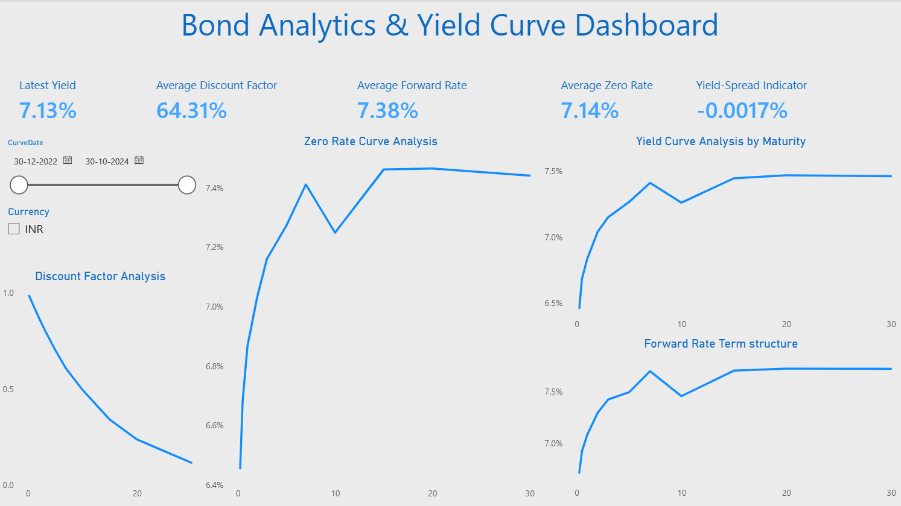
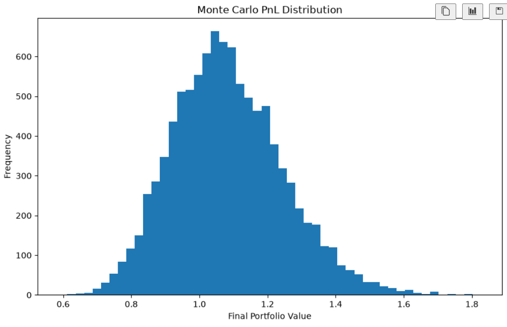
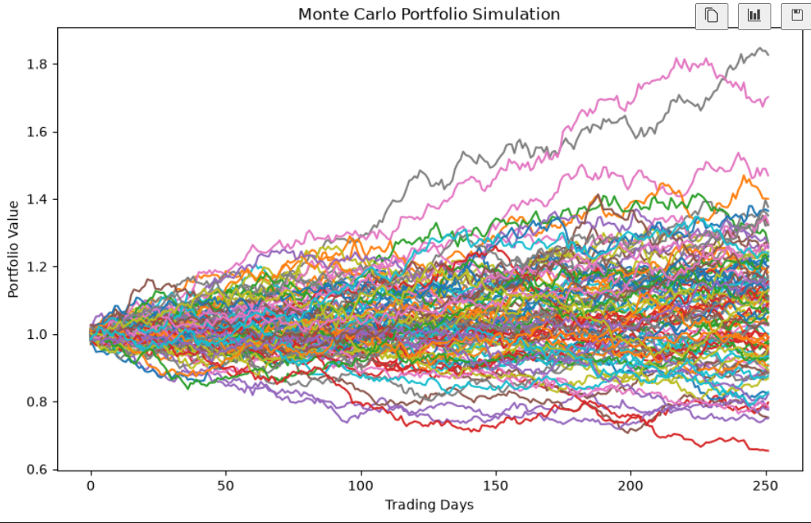
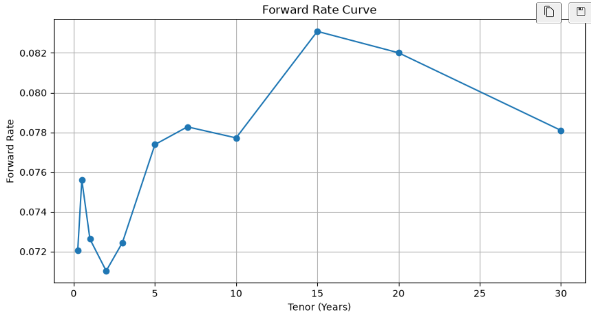
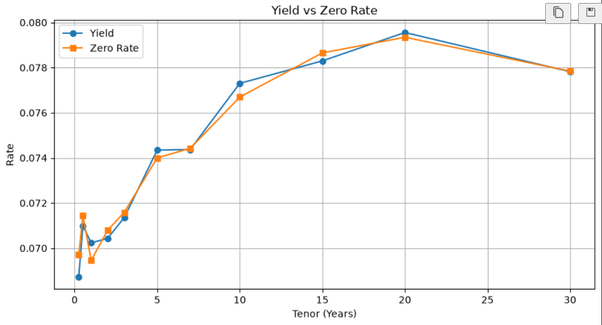
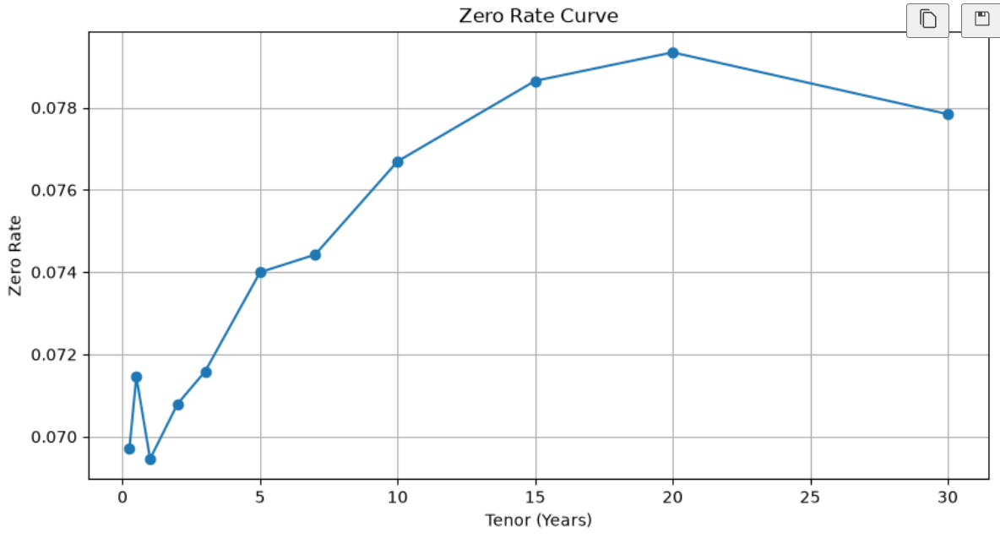

# Bond Analytics & Portfolio Risk Management AI Agent

## Project Overview


A Python-based financial analytics project designed to evaluate fixed-income securities and portfolio risk. The project implements bond pricing models, duration and convexity analysis, Monte Carlo simulations, and yield curve analytics to support investment decision-making and risk assessment.

---

A comprehensive financial analytics project focused on bond valuation, portfolio risk assessment, yield curve analysis, and Monte Carlo simulation. This project leverages Python, SQL, and data visualization techniques to analyze fixed-income securities and support data-driven investment decisions.


## Business Problem

Financial analysts and portfolio managers need effective tools to:

* Evaluate bond prices accurately
* Measure interest-rate sensitivity
* Assess portfolio risk exposure
* Analyze yield curve movements
* Forecast future portfolio performance
* Support investment decision-making through quantitative analytics

This project provides a structured analytical framework to address these challenges.


---

## Business Problem


Fixed-income investors and portfolio managers need reliable methods to:

* Evaluate bond valuations
* Measure interest rate risk
* Analyze portfolio sensitivity
* Forecast portfolio performance under different market conditions
* Visualize yield curve movements and market trends

This project provides an analytical framework to address these challenges using quantitative finance techniques.

---

## Key Features

### Bond Pricing

* Coupon bond valuation
* Present value calculation
* Yield-based pricing analysis

### Duration & Convexity Analysis

* Modified Duration calculation
* Convexity measurement
* Interest-rate sensitivity assessment

### Portfolio Risk Analytics

* Portfolio valuation analysis
* Risk exposure evaluation
* Performance monitoring

### Monte Carlo Simulation

* Portfolio return simulations
* Future value forecasting
* Scenario-based risk analysis

### Yield Curve Analysis

* Yield curve visualization
* Term structure analysis
* Detection of Normal, Flat, and Inverted curves

### Interactive Dashboard

* Portfolio allocation visualization
* Risk metrics dashboard
* Performance monitoring charts
* Calculate bond prices using discounted cash flow methods
* Measure Duration and Convexity for interest-rate risk analysis
* Analyze portfolio-level performance and risk metrics
* Simulate future portfolio values using Monte Carlo techniques
* Visualize yield curve structures and market trends
* Create interactive dashboards for portfolio monitoring
* Apply SQL-based analysis for financial data exploration

---

## Technologies Used

* Python
* SQL
* Pandas
* NumPy
* Matplotlib
* Plotly
* Jupyter Notebook
* Git
* GitHub


---

## Project Structure


Convexity-Sensitivity-AI-Agent/
│
├── data/raw/
│   ├── bond_portfolio_data.csv
│   ├── monte_carlo_scenarios.csv
│   └── yield_curve_history.csv
│
├── notebooks/
├── powerbi/
├── sql/
├── src/
│   ├── bond_pricing.py
│   ├── data_loader.py
│   ├── duration_convexity.py
│   ├── monte_carlo.py
│   ├── risk_metrics.py
│   ├── yield_curve.py
│   └── main.py
│
├── README.md
└── requirements.txt


```

=======

---

## Data Sources

The project utilizes three primary datasets:

### Bonds Dataset

Contains bond-level information including:

* Face Value
* Coupon Rate
* Yield
* Maturity
* Market Price

### Portfolio Dataset

Contains portfolio holdings and allocation details:

* Bond Holdings
* Market Value
* Portfolio Weight
* Yield Metrics

### Yield Curve Dataset

Contains treasury yield information across maturities:

* Short-Term Yields
* Medium-Term Yields
* Long-Term Yields

---

## Analytical Workflow

### 1. Data Loading & Validation

* Import bond, portfolio, and yield curve datasets
* Perform data quality checks
* Validate missing values and data types

### 2. Bond Pricing Analysis

* Discount future cash flows
* Calculate fair bond prices
* Compare market price vs intrinsic value

### 3. Duration & Convexity Analysis

* Measure interest-rate sensitivity
* Evaluate bond price risk
* Assess portfolio exposure

### 4. Portfolio Risk Analysis

* Analyze portfolio composition
* Evaluate concentration risk
* Calculate performance metrics

### 5. Monte Carlo Simulation

* Generate multiple market scenarios
* Forecast future portfolio values
* Assess downside risk

### 6. Yield Curve Analysis

* Visualize yield curve movements
* Identify curve shape changes
* Analyze term structure behavior

### 7. Dashboard Development

* Portfolio allocation visualization
* Risk metric monitoring
* Interactive financial reporting

---

## SQL Analysis

SQL was utilized to support portfolio analytics and data exploration.

### Sample Analytical Tasks

* Portfolio aggregation by bond
* Yield analysis across holdings
* Portfolio value calculations
* Risk metric summarization
* Data filtering and reporting

### Example SQL Queries

```sql
SELECT
    Bond_Name,
    SUM(Market_Value) AS Total_Market_Value
FROM portfolio
GROUP BY Bond_Name
ORDER BY Total_Market_Value DESC;
```

```sql
SELECT
    AVG(Yield) AS Average_Yield,
    AVG(Duration) AS Average_Duration
FROM portfolio;
```

```sql
SELECT *
FROM bonds
WHERE Yield > 0.05;
```

---

## Key Features

### Bond Pricing

* Coupon Bond Valuation
* Present Value Calculation
* Yield-Based Pricing

### Duration & Convexity

* Interest Rate Sensitivity Analysis
* Risk Measurement

### Portfolio Analytics

* Portfolio Valuation
* Risk Assessment
* Performance Evaluation

### Monte Carlo Simulation

* Scenario Analysis
* Risk Forecasting
* Portfolio Projection

### Yield Curve Analysis

* Curve Visualization
* Trend Analysis
* Market Interpretation

### Interactive Dashboard

* Portfolio Monitoring
* Allocation Analysis
* Risk Visualization

---

## Results & Insights

The project successfully delivers:

* Automated bond valuation framework
* Interest-rate risk assessment
* Portfolio sensitivity analysis
* Yield curve interpretation
* Simulation-based forecasting
* Data-driven investment insights

---

## Business Impact

This solution enables analysts and portfolio managers to:

* Improve investment decision-making
* Understand interest-rate exposure
* Quantify portfolio risk
* Forecast future portfolio performance
* Generate actionable financial insights

---

## Future Enhancements

* Real-time market data integration
* Advanced Value-at-Risk (VaR) models
* Credit risk assessment
* Portfolio optimization algorithms
* Power BI integration
* Automated reporting pipelines


---

## Technologies Used


* Python
* Pandas
* NumPy
* Matplotlib
* Plotly
* Jupyter Notebook
* Git
* GitHub

---

## Analytical Workflow

1. Load and validate bond, portfolio, and yield curve datasets.
2. Calculate bond prices using discounted cash flow techniques.
3. Measure Duration and Convexity for interest-rate risk analysis.
4. Perform portfolio risk assessment and exposure analysis.
5. Execute Monte Carlo simulations for future portfolio valuation.
6. Analyze yield curve dynamics and market trends.
7. Visualize findings through dashboards and interactive charts.

---

## Results & Insights

* Automated bond valuation process
* Interest-rate risk measurement
* Portfolio sensitivity analysis
* Yield curve trend identification
* Simulation-based risk forecasting
* Interactive portfolio dashboard

---

## Business Impact

This solution helps analysts and portfolio managers make informed investment decisions by providing:

* Better risk visibility
* Quantitative portfolio assessment
* Interest-rate sensitivity analysis
* Data-driven investment insights
* Enhanced financial reporting capabilities

---

## Future Enhancements

* Real-time market data integration
* Credit risk modeling
* Portfolio optimization algorithms
* Advanced Value-at-Risk (VaR) models
* Power BI dashboard integration
* Automated reporting workflows

## Power BI Dashboard

### Bond Analytics & Yield Curve Dashboard

This interactive Power BI dashboard provides insights into:

- Yield Curve Analysis by Maturity
- Zero Rate Curve Analysis
- Forward Rate Term Structure
- Discount Factor Analysis
- Interactive Curve Date Filtering
- Fixed Income Market Analytics

### Dashboard Preview




## Monte Carlo Simulation






## Yield Curve Analysis








## Business Conclusions

1. Portfolio duration is the primary driver of interest-rate risk.
2. Convexity improves price sensitivity estimates.
3. Yield curve shifts significantly affect long-duration securities.
4. Monte Carlo simulation provides probabilistic risk estimates.
5. Portfolio managers can use these insights for hedging and asset allocation decisions.


---

## Author

### Renu Shokeen

Data Analyst | Python | SQL | Power BI | Financial Analytics


### Connect

* LinkedIn: https://www.linkedin.com/in/renu-shokeen-428756364?utm_source=share_via&utm_content=profile&utm_medium=member_android
* GitHub: https://github.com/Renu85


### Skills

* Data Analysis
* Financial Analytics
* Python
* SQL
* Power BI
* Data Visualization
* Statistical Analysis

---

## GitHub Portfolio Project

This project was developed as part of a hands-on financial analytics and portfolio risk management learning initiative, demonstrating practical applications of Python, SQL, quantitative finance, and data visualization techniques.